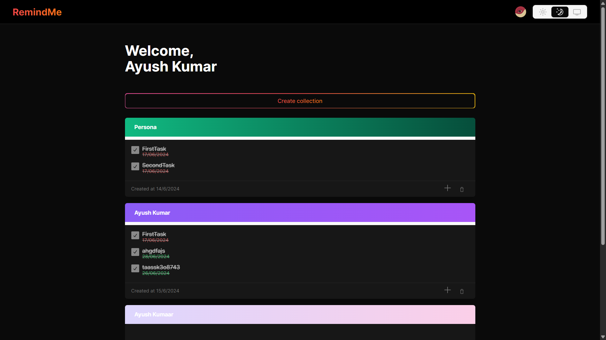

# Remind Me App

Remind Me is a web application built using Next.js, Tailwind CSS, and TypeScript that allows users to create and manage collections of tasks for different people. Each task can have a deadline, and users can create, delete, and manage multiple collections. The app also includes a dark mode for a better user experience. Data is stored using Prisma.

## Table of Contents

- [Features](#features)
- [Technologies Used](#technologies-used)
- [Getting Started](#getting-started)
- [Scripts](#scripts)
- [Contributing](#contributing)
- [License](#license)
- [Screenshot](#screenshot)

## Features

- **Create Collections**: Create collections by the name of a person.
- **Manage Tasks**: Add as many tasks as needed to each collection, each with its own deadline.
- **Delete Collections**: Remove collections when they are no longer needed.
- **Dark Mode**: Toggle between light and dark modes.
- **Data Persistence**: All data is stored and managed using Prisma.

## Technologies Used

- **Next.js**: A React framework for production.
- **Tailwind CSS**: A utility-first CSS framework.
- **TypeScript**: A typed superset of JavaScript.
- **Prisma**: A next-generation ORM for Node.js and TypeScript.

## Getting Started

### Prerequisites

- Node.js (>= 14.x)
- npm (>= 6.x) or yarn (>= 1.x)
- PostgreSQL (or any other supported database by Prisma)

### Installation

1. Clone the repository:
   ```bash
   git clone https://github.com/willeynimbus/remind-me.git
   cd remind-me-app
   ```


2. Install dependencies:

   ```bash
   npm install
   # or
   yarn install
   ```

3. Set up your database:

   - Create a `.env` file in the root directory.
   - Add your database connection string to the `.env` file:
     ```env
     DATABASE_URL="your-database-connection-string"
     ```

4. Run Prisma migrations to set up the database schema:
   ```bash
   npx prisma migrate dev --name init
   ```

### Running the Application

To start the development server:

```bash
npm run dev
# or
yarn dev
```

Open [http://localhost:3000](http://localhost:3000) with your browser to see the result.

## Scripts

- `dev`: Runs the application in development mode.
- `build`: Builds the application for production.
- `start`: Starts the application in production mode.
- `lint`: Runs ESLint to check for linting errors.
- `prisma`: Various Prisma commands (e.g., `migrate`, `generate`).

## Contributing

Contributions are welcome! Please open an issue or submit a pull request for any changes.

## License

This project is licensed under the MIT License. See the [LICENSE](LICENSE) file for more details.

```

Feel free to modify this `README.md` file to better suit your project's specific details and requirements.
```

## Screenshot

- 
